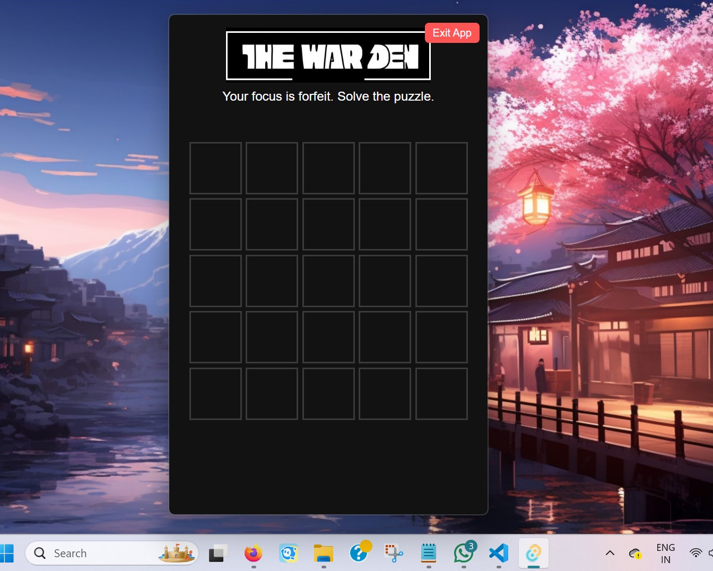
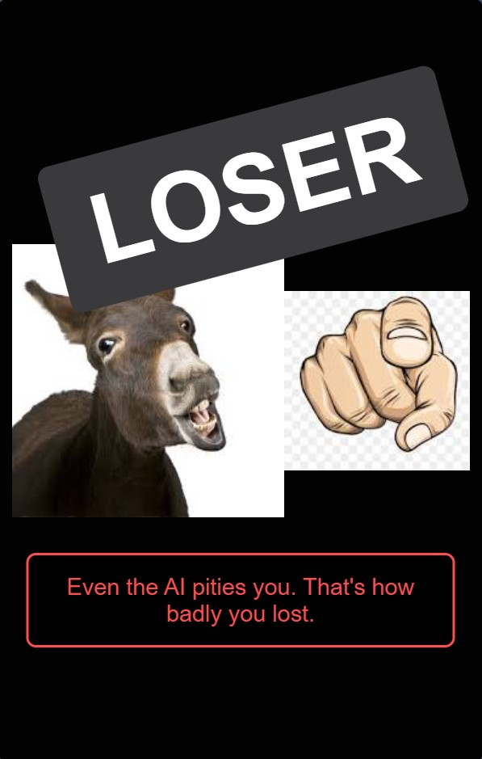
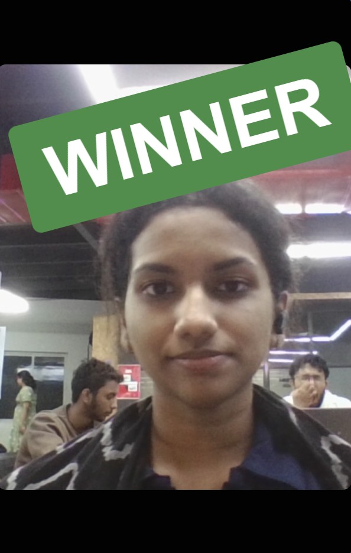

# The-Warden 🎯

## Basic Details
### Team Name: Akshara C A (solo)

### Project Description
The Warden is a desktop word puzzle game built with Tauri that ambushes the user with a fullscreen window. The app's purpose is to command the user's full attention. It features a unique end-game experience: a celebratory photo and particle animation for winning, or a humiliating insult for losing.

### The Problem (that doesn't exist)
In an age of constant busywork, true focus is a rare commodity. The problem isn't a lack of productivity, but a lack of intentionality, as our minds are constantly pulled between a dozen minor distractions. The Warden app addresses this by creating a digital space with no escape. It transforms a simple word puzzle into a test of mental fortitude, with a humiliating penalty for failure. The app ensures that when your focus is demanded, there is nowhere to hide from the task at hand.

### The Solution (that nobody asked for)
The Warden’s solution is both simple and ruthless: if your focus is found wanting, it will be forfeited. The app takes over the user’s screen, creating a digital cage with nothing but the puzzle. The punishment for failure is not a simple message, but a personal and humiliating judgment, complete with a damning photograph and a custom AI-generated insult. The app ensures that the next time you feel the urge to multitask, you will remember the Warden’s mocking glare.

## Technical Details
### Technologies/Components Used
For Software:
- Languages: Rust, JavaScript (ES6+), HTML, CSS

- Frameworks: Tauri (for desktop app), React (for the UI), Vite (as a build tool)

- Libraries: TensorFlow.js (for client-side face detection), Google Gemini API (for AI-generated insults), @tauri-apps/api/core (for frontend-backend communication)

- Tools: Node.js, npm, Cargo (Rust's package manager)

For Hardware:
- Main Components: A desktop or laptop with an integrated or external webcam.

- Specifications: A modern computer capable of running a Tauri application and a webview. The webcam should be functional and accessible by the operating system.

### Implementation
For Software:
# Installation

#Clone the repository
git clone https://github.com/your-username/warden-app.git
cd warden-app

#Install dependencies
npm install

# Run
[npm run tauri dev]

### Project Documentation
For Software:
Installation
#In the project root directory
npm install

Run
This command runs both the Rust and React parts of the app
npm run tauri dev

# Screenshots (Add at least 3)

*This screen shows the puzzle interface that locks the user in unexpectedly*

*If the user fails the puzzle, The Warden delivers punishment via a webcam photo and an AI-generated insult.*

*Successfully completing the puzzle unlocks the screen and earns the user a smug pass — for now.*

### Project Demo
# Video
[https://drive.google.com/file/d/1d9ExaDh2Tvg5RHsH7jOrI-MUcDckp2gn/view?usp=drive_link]
*This video demonstrates two full rounds of The Warden in action. In the first round, the user successfully completes the puzzle and is released. In the second round, the user fails, triggering the punishment screen with a webcam photo and a custom insult.*

---
Made with ❤️ at TinkerHub Useless Projects 

